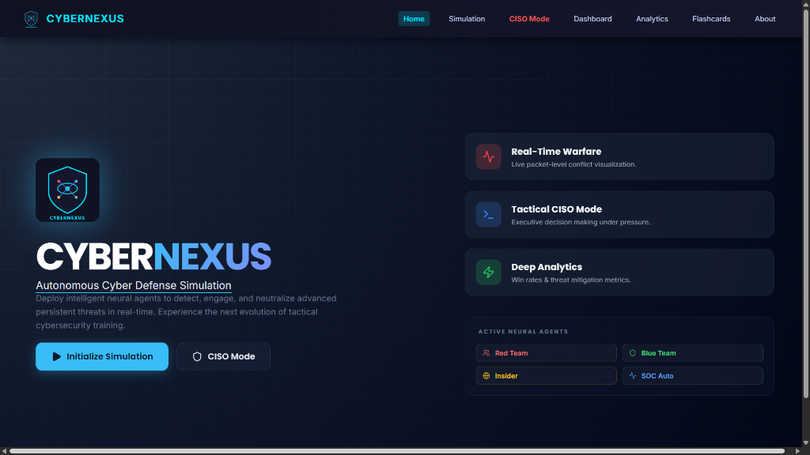
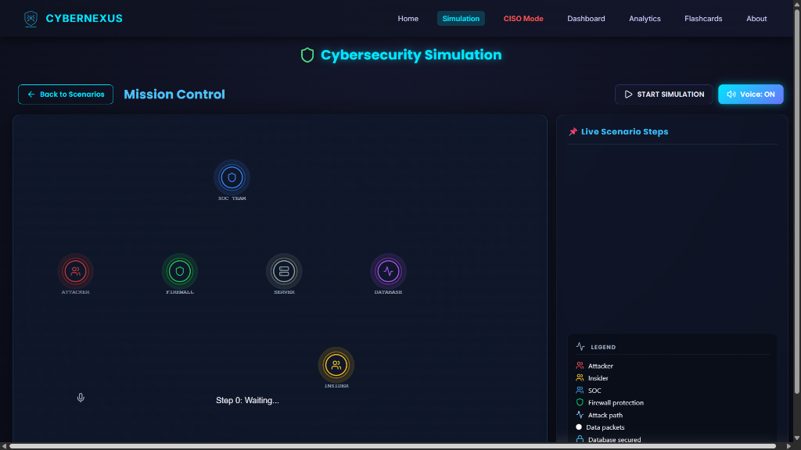
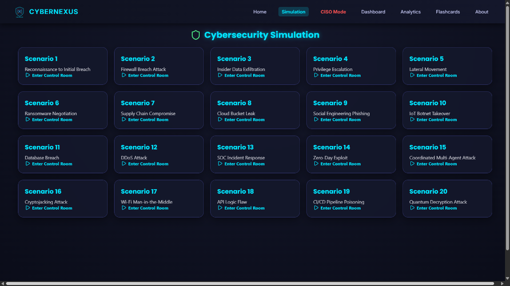
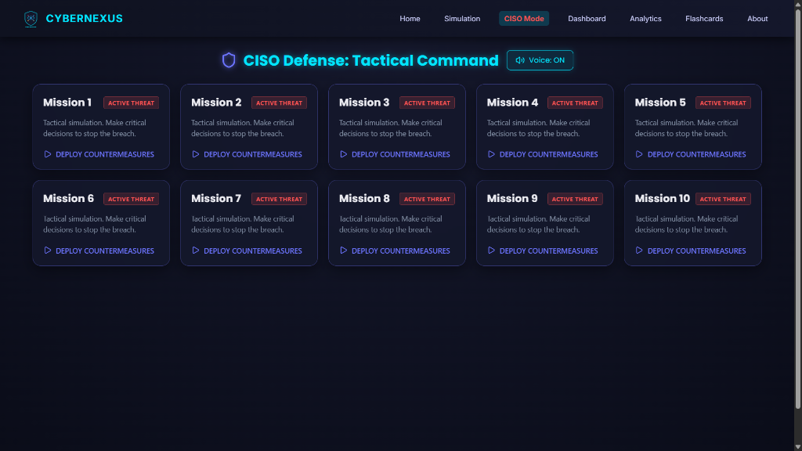
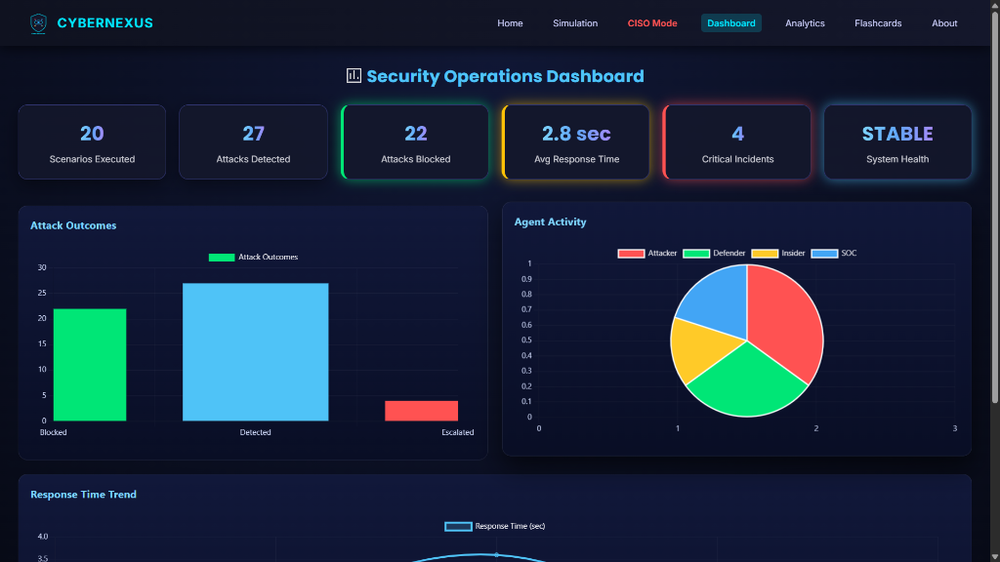
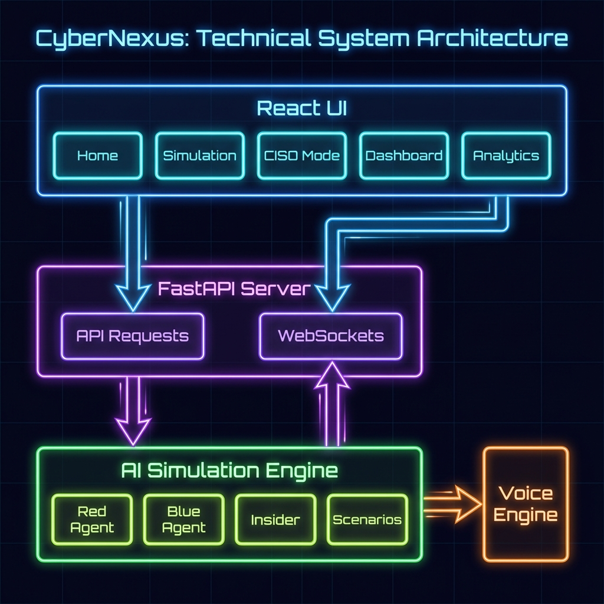

# 🛡️ CYBERNEXUS: Next-Gen AI Cybersecurity Simulation

   

> **Experience the future of autonomous cyber defense.**  
> CyberNexus is an advanced simulation platform that uses Multi-Agent Reinforcement Learning (MARL) to simulate real-time cyber warfare. Watch autonomous Red Team (Attacker) and Blue Team (Defender) agents battle in a packet-level simulation, or take command yourself in the tactical CISO Mode.

---

## 📸 Interface Preview

### **Command Center (Home)**
The central hub for accessing all simulation modules.


### **Real-Time Simulation**
Live packet warfare visualization between localized neural agents.


### **Scenario Selection & Briefing**
Choose from 20+ diverse attack scenarios to simulate.


### **Tactical CISO War Room**
Executive decision-making interface for high-stakes scenarios.


### **Analytics Dashboard**
Comprehensive metrics and live log analysis.


---

## � Key Features

### 1. **Autonomous Simulation**
*   **Packet-Level Warfare**: Visualizes network traffic, exploits, and defense mechanisms in real-time.
*   **Multi-Agent System**:
    *   🔴 **Red Team**: Uses RL to find vulnerabilities and launch exploits (DDoS, SQLi, Phishing).
    *   🟢 **Blue Team**: Autonomously patches systems and blocks IPs.
    *   🟡 **Insider Threat**: Simulates compromised internal credentials.
    *   🔵 **SOC Agent**: Orchestrates high-level defense strategies.
*   **Voice Narration**: Real-time TTS commentary of the battle (optional).

### 2. **Tactical CISO Mode**
*   **Roleplay Experience**: Step into the shoes of a Chief Information Security Officer.
*   **Decision Scenarios**: Face 20+ complex security incidents (Ransomware, Data Leaks, APTs).
*   **Immediate Feedback**: Receive instant grading (Green/Red) on your strategic choices.

### 3. **Deep Analytics & Reporting**
*   **Mission Dashboard**: Track total scenarios, active agents, and uptime metrics.
*   **Live Log Engine**: Visualize attack vectors and severity distribution in real-time.
*   **PDF Reports**: Generate detailed after-action reports (AAR) for training analysis.

### 4. **Educational Tools**
*   **Flashcards**: Interactive learning modules for cybersecurity terminology.
*   **Architecture Theory**: Visual diagrams explaining the React-FastAPI-RL pipeline.


---

## 🏗️ System Architecture



The CyberNexus platform follows a modern separated frontend/backend architecture:

1.  **Frontend (React UI)**: Users interact with the **Home** portal, command the **CISO Mode** strategy, and view real-time data on the **Dashboard** and **Analytics** panels.
2.  **Backend (FastAPI)**: Serves as the central controller, handling REST API requests for simulation state and maintaining WebSocket connections for real-time packet visualization.
3.  **Simulation Core (AI Engine)**: The heart of the system where **Red Agents** (Attackers) and **Blue Agents** (Defenders) interact within defined **Scenarios**.
4.  **Peripheral Services**:
    *   **Voice Engine**: Generates TTS commentary based on simulation events.
    *   **Data Storage**: Logs historical match data and analytics logs.

---

## 🛠️ Tech Stack

### **Frontend**
*   **Framework**: React 19 (Create React App)
*   **Styling**: Vanilla CSS (Cyberpunk/Glassmorphism Theme)
*   **Visualization**: Chart.js, Konva (Canvas), Framer Motion
*   **Icons**: Lucide React

### **Backend**
*   **API**: FastAPI (Python)
*   **AI/ML**: PyTorch, OpenAI Gym (Reinforcement Learning)
*   **Simulation**: NumPy, Pandas
*   **Voice**: Pyttsx3 (Text-to-Speech)

---

## 🚀 Installation & Setup

### **Prerequisites**
*   Node.js (v16+)
*   Python (v3.9+)
*   Git

### **1. Clone the Repository**
```bash
git clone https://github.com/shreyar29/AI-Based-Cybersecurity-Simulation-Using-MARL.git
cd AI-Based-Cybersecurity-Simulation-Using-MARL
```

### **2. Backend Setup**
```bash
cd backend
# Create virtual environment (optional but recommended)
python -m venv venv
# Windows:
venv\Scripts\activate
# Mac/Linux:
source venv/bin/activate

# Install dependencies
pip install -r requirements.txt

# Run the API Server
uvicorn main:app --reload
```
*Backend will start at `http://localhost:8000`*

### **3. Frontend Setup**
```bash
# Open a new terminal
cd cyber-sim-ui

# Install dependencies
npm install

# Start the User Interface
npm start
```
*Frontend will launch at `http://localhost:3000`*

---

## 📂 Project Structure

```
├── backend/
│   ├── agents/          # RL Agent definitions (Red/Blue/Insider)
│   ├── marl/            # Multi-Agent Reinforcement Learning logic
│   ├── scenarios/       # Attack scenario definitions (JSON/Py)
│   ├── main.py          # FastAPI Entry Point
│   └── requirements.txt # Python dependencies
│
├── cyber-sim-ui/
│   ├── public/          # Static assets
│   ├── src/
│   │   ├── components/  # Reusable UI widgets
│   │   ├── pages/       # Applications modules (Home, Sim, CISO, Dashboard)
│   │   ├── styles/      # CSS Design System
│   │   └── App.js       # Main Routing Logic
│   └── package.json     # Node dependencies
│
└── assets/              # Screenshots and documentation media
```

---

## 🎮 Usage Guide

1.  **Start the Simulation**:
    *   Navigate to the **Simulation** page.
    *   Click `Start Simulation`.
    *   Watch the agents interact on the canvas. Use "Voice Mode" to hear the commentary.

2.  **Play CISO Mode**:
    *   Go to **CISO Mode**.
    *   Read the scenario prompt (e.g., "Ransomware detected on HR Server").
    *   Select the best response from the 4 options.
    *   Get instant feedback on your decision.

3.  **Analyze Results**:
    *   Visit the **Dashboard** to see global stats.
    *   Check **Analytics** for detailed log breakdowns.

---

## 🔮 Future Enhancements
*   **Multiplayer Red vs. Blue**: Allow human players to control agents in real-time.
*   **LLM Integration**: Use Large Language Models for dynamic scenario generation.
*   **Cloud Deployment**: Dockerize the application for AWS/Azure hosting.
*   **Mobile App**: React Native version for on-the-go training.

---

## 👥 Contributors
*   **Concept & Development**: Shreya R

---
*Built with ❤️ for the Cyber Defense Community.*
